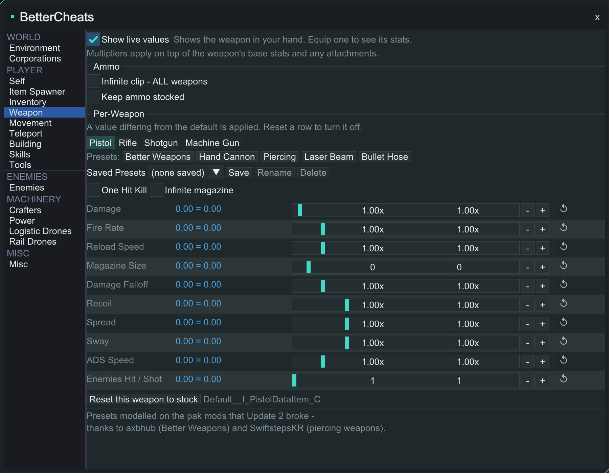
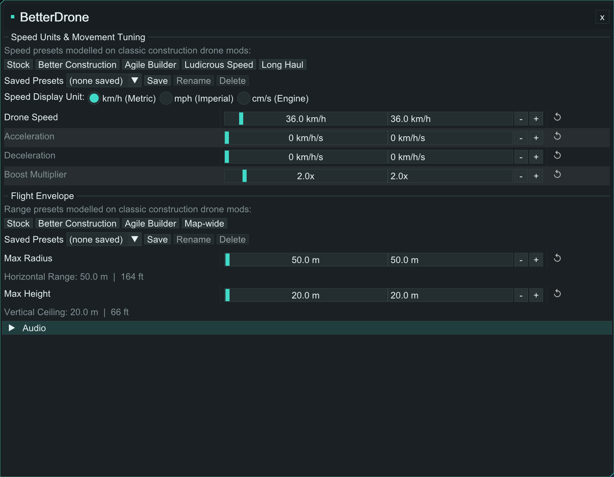
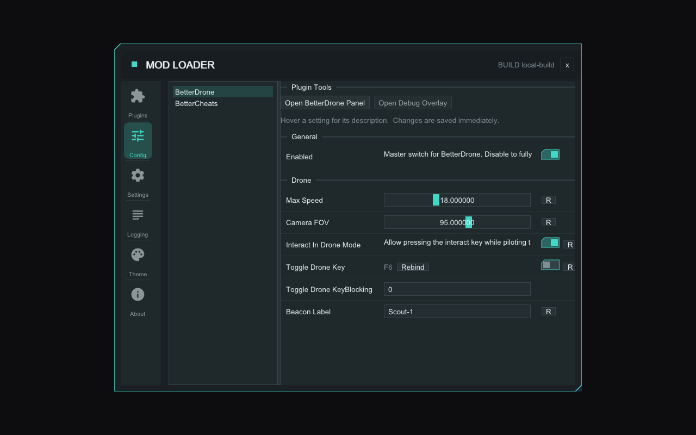
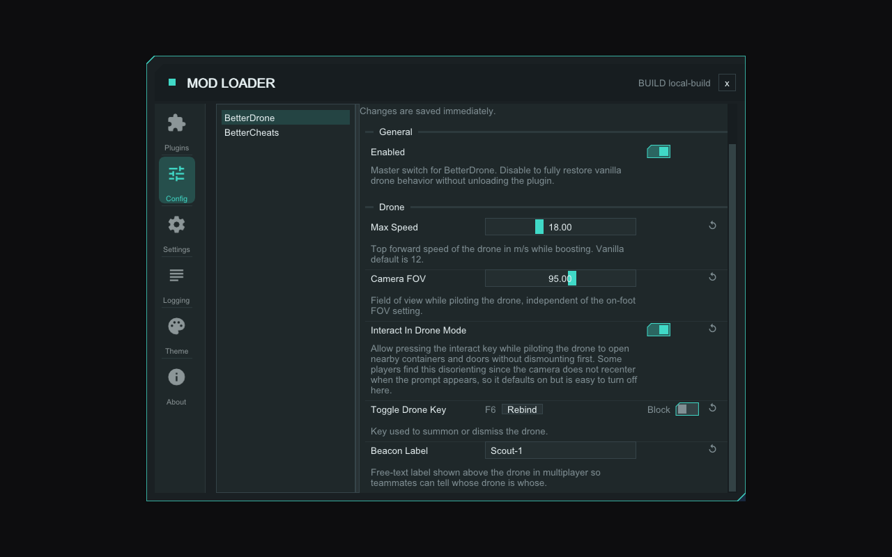
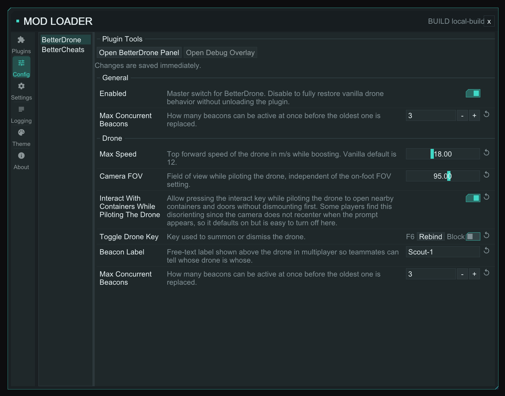

# GSS contributions on top of the ModLoader and two plugins

This all started because the loader held up when Update 2 broke every pak mod I had, and when I went digging the code was easy enough to find my way around that I kept going. I got a bit carried away from there.

Every change is its own commit, and the commit messages go into more detail than this doc does. Take any subset of it. Nothing here assumes the rest lands too.

## What's in here

**BetterCheats**
- Per-weapon stats that compose with attachments instead of overwriting them
- Live-values readout to see the composition actually holding
- Grenade charge/capacity controls, plus global fuse/blast-radius/throw-force tuning
- Three-tier item stack size overrides (global, category, per item)
- Saved presets in every section with adjustable settings

**BetterDrone**
- Boost follows the player's Sprint binding by default
- Four independent audio volume sliders
- Separate speed and range presets, pick either independently
- Saved presets for the speed and range groups
- New in-game panel with live sliders and unit choices

**Loader: UI**
- Config page labels and descriptions layout adjustments
- Sliders now have a maximum width, and floats show 2 decimals
- Material Icons reset glyph on every reset button
- Named themes, with save/rename/delete and a Star Rupture theme
- Escape closes the ModLoader window
- Rebind picker can capture a bare modifier key
- Companion Blocking key now shows only as the keybind row's Block toggle

**Loader: fixes**
- Bare Shift/Ctrl/Alt keybinds now reach plugins (fix)
- Panel Unload/Load/Reload now posts through GameThreadDispatch, matching the console commands (fix)
- Panel `isOpen` now re-reads after render, so a self-closing panel stays closed (fix)

**Open questions**
- A shared preset store in the SDK
- A way to enumerate an object's properties by walking, not just resolve by name

This covers three branches, all pushed to forks under `msantoro12` so you can look at any of it without it touching your own repos:

- Loader: `github.com/msantoro12/StarRupture-ModLoader/tree/gss/loader-work` (branched from `v1.21.2`)
- BetterCheats: `github.com/msantoro12/StarRupture-Plugin-BetterCheats/tree/gss/plugin-work` (vs `origin/main`)
- BetterDrone: `github.com/msantoro12/StarRupture-Plugin-BetterDrone/tree/gss/plugin-work` (vs `origin/main`)

## Plugins

Briefer, since these are ours to begin with.

**BetterCheats.** Weapon and movement attribute overrides now compose onto the game's own values instead of overwriting them, so LEMs, buffs, and attachments keep layering on top correctly. A live-values readout (hover any row for a base/buffed/change/result breakdown, plus a `+buff`/`+mods` tag when something else is contributing) was added mainly to prove that in-game. Magazine Size got repointed to the field the equipped-weapon getter actually reads, after tracing why the old target wasn't moving the clip. Grenades got their own tab: charge cost, max/min charge, and infinite charges compose the same way weapons do, and fuse time, blast radius, and throw force are new global controls resolved by property name against classes that only exist in the game's Server-side SDK headers. Item stacks got a three-tier size override: global multiplier, then per-category, then per-item, most specific wins. And saved presets (name it, save it, it follows you across worlds) are now available in every section with adjustable settings, backed by a small INI-based store.

*BetterCheats at 900x700. The panel is rendered outside the game for this capture, so the numbers on screen are placeholders, not real values.*

**BetterDrone.** Boost now defaults to following whatever key the game has bound to Sprint, so there's no separate default to remember. It's still rebindable to something else if you want. It ramps via configurable acceleration/deceleration instead of snapping, and clamps to the drone's configured max speed. Four independent volume sliders for the drone's own sounds (idle, movement, rotation, station) were added, plus a "master volume" convenience slider that drives all four together. Speed and range presets are now separate axes. There are five speed presets and four range presets, and you can pick either independently, so a faster preset doesn't force a specific range on you (two of them are explicitly credited to CrazyCovin's "Better Construction Drone," NexusMods #27). Both groups also take saved presets of your own, alongside those built-ins. There's a new in-game panel (default toggle key F8, closes on Escape or Q) with live sliders, unit choices (km/h or mph for speed, m/ft/cm for range), and a reset button per field. Panel values are cached in memory and only written to disk when you finish editing a field, not on every tick.

*BetterDrone at 900x700. The panel is rendered outside the game for this capture, so the numbers on screen are placeholders, not real values.*

Both plugins also picked up saved presets, the panel-flicker-on-close fix, and the slider/reset-icon changes as matching pairs. Same shape, same fix, applied to our own code in both places once we'd worked it out in one.

## Loader

The UI additions, then three fixes, plus one bit of local build plumbing you probably don't want.

The UI work, roughly in the order you'd run into it:

*Before: fixed-width label column, long names run past it, description only visible as a hover marquee.*

*After: label column sized to content, wrapped description line, rows centered on their tallest content.*

*The same config page at a narrow window, showing how the layout reflows.*

- Config page: the label column was a fixed 160px, and a longer label would run past it. Descriptions displayed as a hover-only marquee. The column now sizes to the widest label on the page (up to whatever width is left) and only wraps when needed. The row keeps its three columns (label, control, actions), with descriptions wrapping across the row's full width beneath the label. Rows center vertically on their tallest content instead of aligning to the top. A keybind row's companion Blocking key now shows only as that row's Block toggle, instead of also rendering as its own separate entry.
- Sliders now have a maximum width (240px, scaled with UI font size) instead of filling the whole widget column, and float sliders/inputs format to 2 decimals instead of 6. Stored precision is unchanged either way.
- The reset button (a plain "R" before) and the Logging tab's "Reset All To Default" (no icon before) both now draw the `replay` glyph (U+E042) from the Material Icons font the sidebar already uses, styled the same as your other link-style text.
- Named themes: the Theme tab held a single custom palette. A Theme dropdown now offers two built-ins, Default and a new "Star Rupture" theme matching the game's own value/hover/structure colors, plus any user theme saved to `ModLoader\Themes\<name>.ini`, shareable as a file. This also splits `Highlight` and `PanelBorder` out as their own color roles instead of reusing `Accent` for both "this is a value" and "this is hover/selected," which the game itself keeps visually distinct.
- Escape now closes the ModLoader window, same as every plugin panel already does. It's deferred a frame so it doesn't collide with the rebind picker's own Escape-cancels-capture handling.
- The rebind picker previously skipped every modifier VK outright. It now tracks a held modifier and commits it alone if released with nothing else pressed in between, so a plugin's key can be rebound to a bare modifier like "LeftShift" directly from the picker, matching the dispatch change below.

Three fixes, same level of detail:

**Bare modifier keybinds now dispatch to plugins.** `ResolveSidedVK` in `keybind_registry.cpp` resolves the sided VK for a plain `"LeftShift"` registration, but `ProcessWindowMessage` returned early for every modifier VK before that resolved value reached `Dispatch`/`DispatchCombo`. Dispatch now runs first, so a plugin registered on a bare modifier fires. `ShouldBlock`'s answer is still ignored for modifiers afterward, so Shift still sprints.

**Panel Unload/Load/Reload now posts through GameThreadDispatch, matching the console commands.** The console's own `unload`/`load`/`reload` commands already post through `GameThreadDispatch` and run on the game thread. The ModLoader window's Unload/Load/Reload buttons call `PluginManager::UnloadPlugin`/`ReloadPlugin` from `Render()`, which runs on the render thread inside the D3D Present hook. Both functions call a plugin's `PluginShutdown`/`PluginInit`, which several plugins document as game-thread-only (BetterCheats' `player_lookup.h`, for one). The buttons now post through the same `GameThreadDispatch` queue as the console path, and each plugin row shows "..." and disables while its action is in flight, so a double-click can't queue a second pass on top of one still running.

**Panel `isOpen` re-reads after render, so a self-closing panel stays closed.** `RenderPanelWindows` in `plugin_panel_registry.cpp` reads a panel's `isOpen` into a local before calling its render function. When a plugin closes its own panel mid-render (its own Escape handling, say), the write-back that followed landed one statement later and reopened it. The panel flickered, the plugin had already released its input-capture token, and the registry still considered the panel open, so its keybinds read as dead until you clicked something. `isOpen` is now re-read after the render call instead of the pre-render snapshot, and both the read and the write-back take `s_mutex`, matching every other accessor in that file.

One more commit stamps a real file version into local builds (`/p:ModLoaderVersion=X.Y.Z`) so the auto-updater doesn't see `1.0.0.0` and offer to overwrite a local build on next launch. That's plumbing for our own builds, not something you need upstream. Happy to drop it from anything that goes your way.

## Two things worth your opinion

**A shared preset store in the SDK.** The same named-collection shape shows up in three places already: the loader's own `theme.cpp` for named themes, and our BetterDrone and BetterCheats preset stores (BetterDrone's `preset_store.h/.cpp` came first, and BetterCheats copied it almost verbatim, per its own header comment). Each is its own copy of the same thing: a named collection of settings, backed by one INI, with list/save/load/delete against it. Wrote up a proposal for pulling that into `IPluginHooks` as `IPluginPresetStore` instead. It's additive only, and it doesn't touch `PLUGIN_INTERFACE_VERSION_MIN`. It's `sdk-preset-proposal.md`, not attached as a patch since whether it's worth the SDK surface is your call.

**Enumerating an object's properties.** `IPluginObjectProperties::FindPropertyByName` resolves a property a plugin already knows the name of. Discovering names on an object without a header for it (a modded Blueprint, an unknown GameplayEffect, whatever else shows up later) isn't covered yet. The loader already does exactly this walk internally, for its own debug dump (`ExportKnownProperties` in `object_properties.cpp`). It's scoped to every class in `GObjects` at once and writes to a file instead of a buffer, but the walk itself already exists. An `EnumeratePropertiesInto(object, outArray, capacity)` scoped to one object looks like a small, additive extension of what's already written. Covered as a secondary note in the same proposal doc.

## What it's tested against

Loader `v1.21.2`, game build `++Earth20+Neon-HF2.5-CL-126119`. All of this is in daily play use on our end, but it's still moving. Expect more commits on these branches, not a finished state.
